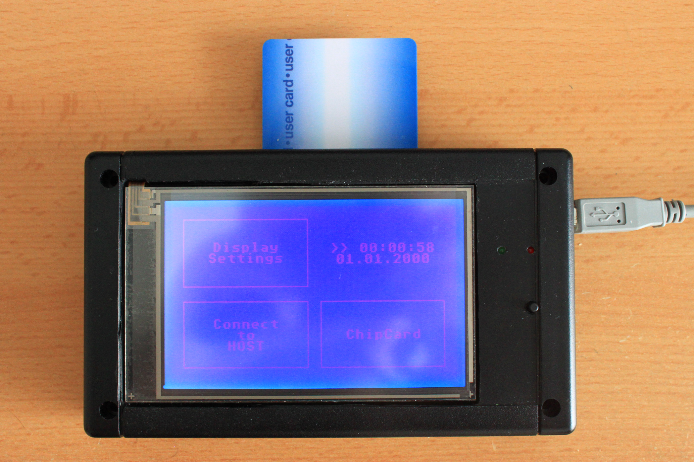

In my USB-Board i use 240x128 dots Display with Touch: eDIP240B-7LWTP of "ELECTRONIC ASSEMBLY"   www.lcd-module.de

<<<<<<< HEAD

  

=======

  

>>>>>>> origin/master
This USB-Board can be connected to Front- or Back-USB for making a configuration of NAS or (W)LAN-Router.

If you have interests on my project please contact me.
